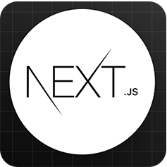

<!-- ============================================================
                             HEADING
============================================================== -->
<h1 align="center"> 
   
  Hello there... I am Gauri 
  
</h1>

  
  
  

---

<h2 align="left">👩‍💻 About Me</h2>

  Full-stack developer with a passion for creating elegant, efficient solutions. My journey began with simple HTML pages and has evolved into building complex web applications. I thrive on solving problems through code and enjoy both front-end aesthetics and back-end architecture. When I'm not coding, you'll find me contributing to open-source projects, learning new technologies, or mentoring aspiring developers.

---

  

---

<h2 align="left">🛠 Tech Stack</h2>

<h3 align="left">🌐 Frontend</h3>

  
  
  
  
  
   
  
  
  
  

<h3 align="left">⚙️ Backend</h3>

  
  
  
  
  
  

<h3 align="left">📚 Languages</h3>

  
  
  
  
  
  
  

<h3 align="left">🛠️ Tools & Platforms</h3>

  
  
  
  
  
  
  
  

<h3 align="left">☁️ Cloud & Deployment</h3>

  
  
  
  
  

---

<!--  <h2 align="left">📈 GitHub Stats</h2>

  
  

  

-->

---

<h2 align="left">🏆 Achievements</h2>

- 🏅 Google Developer Student Club Lead
- 🥇 Winner at HackTheMountains Hackathon
- 📜 Certified in Full Stack Development
- 🎤 Speaker at multiple tech conferences

---

<h2 align="left">📫 Let's Connect</h2>

  
 <!--   -->
  <!-- -->
  

