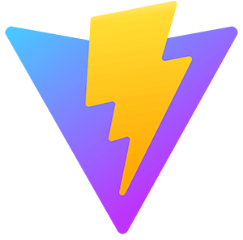
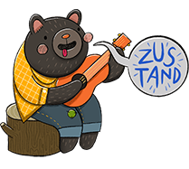
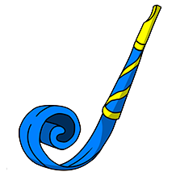

<!-- ============================================================
                             HEADING
============================================================== -->
<h1 align="center"> Hello there... I am Gauri </h1>

  

###

<h2 align="left">👩‍💻  About me</h2>

###

My journey into the world of web development began with a keen interest in problem-solving and a love for technology. From an early age, computers fascinated me, and I was captivated by the endless possibilities they offer. This curiosity led me to pursue a career in software development.

I began my educational journey by immersing myself in programming languages such as HTML, CSS, and JavaScript. Gradually refining my skills, I delved into the intricacies of both front-end and back-end development, striving to understand how each component comes together to create a seamless user experience.

Throughout the learning process, I eagerly embraced challenges, constantly seeking out new opportunities to expand my knowledge. I view each project as an opportunity for growth and learning.

As a novice full-stack developer, I am passionately driven to use my skills to create innovative solutions that matter. I thrive in collaborative environments where I can make my unique contribution and learn from experienced professionals. With strong skills in both front-end and back-end development, I am eagerly awaiting the opportunity to embark on this journey and continue my development as a versatile and adaptive developer.

###

 

###

<h2 align="left">🛠 Technologies:</h2>

###

 

    

<!--     -->
 

<!--    -->

<!--      -->
 
 
 
 
 
 

  

 

 
 

